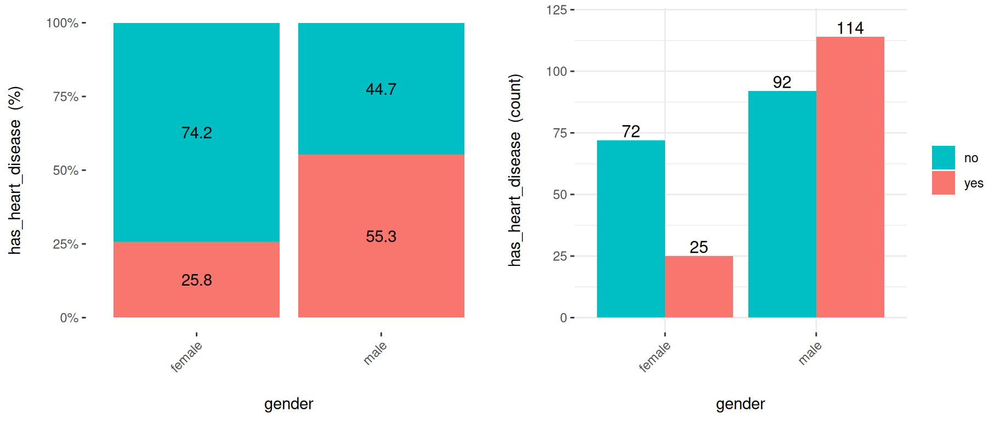
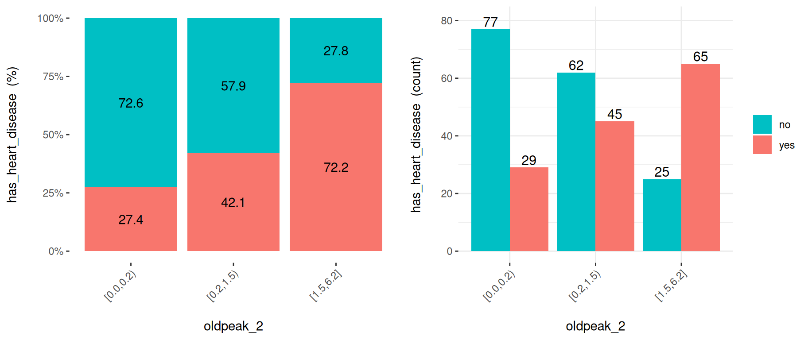
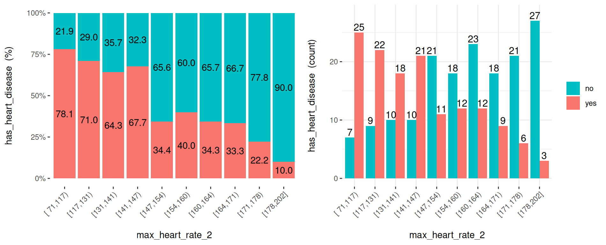
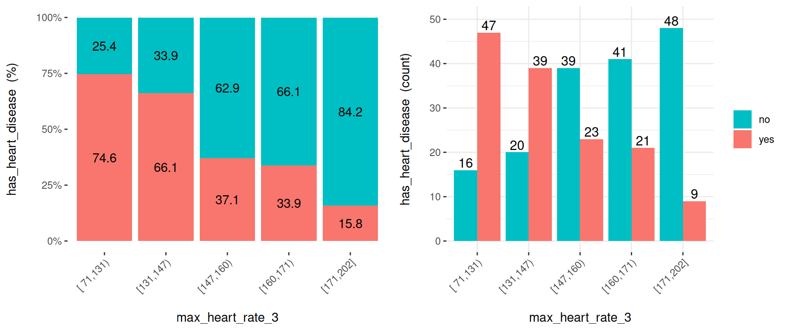
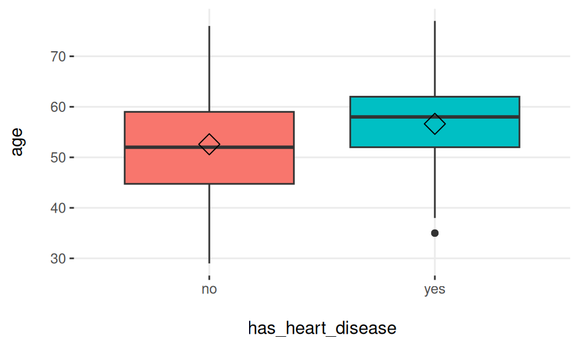
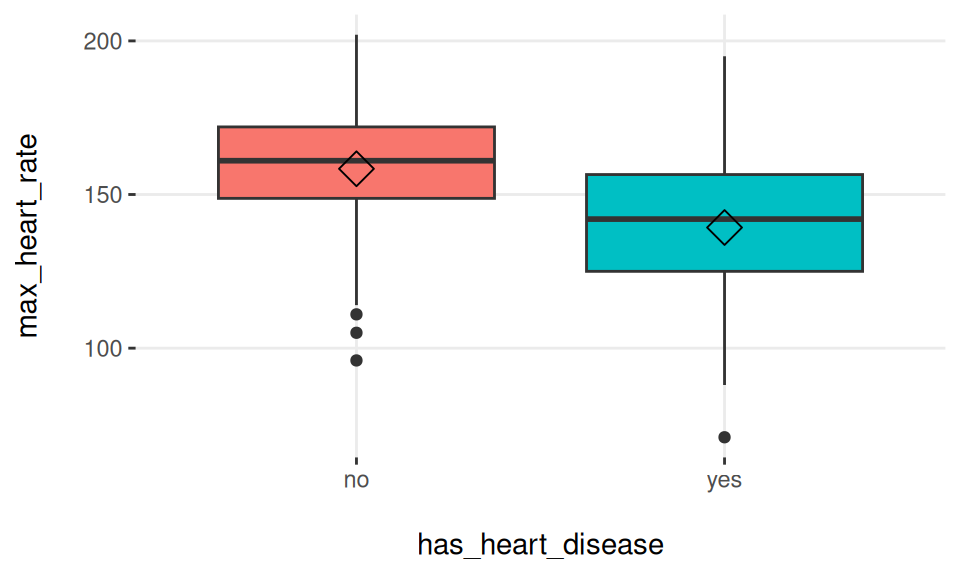
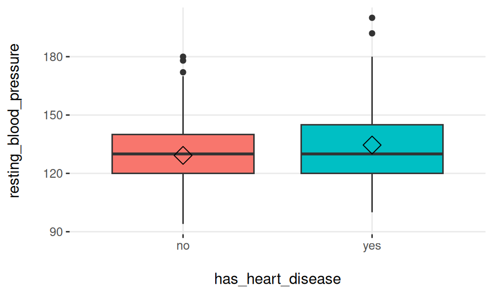
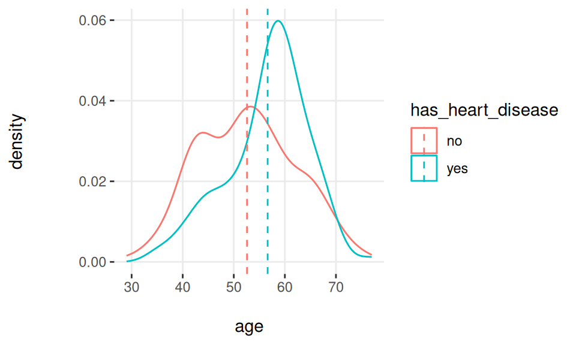
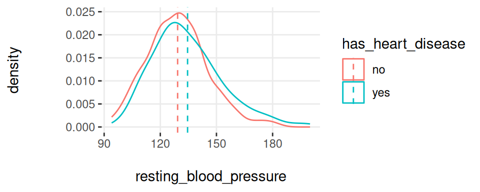
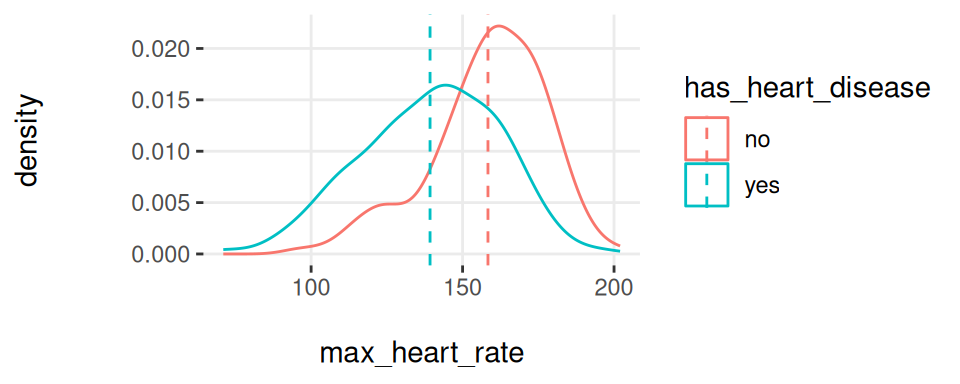

# 최적 변수 선택 {#selecting_best_variables}

## 최적 변수 선택의 일반적 측면 {#general_aspects_selecting_best_variables}

### 무엇에 대한 내용인가요?

이 장에서는 다음 주제들을 다룹니다:

* 예측 모델 또는 클러스터링을 포함한 전통적인 머신러닝 알고리즘의 변수 중요도 순위.
* 예측 모델이 있는 경우와 없는 경우의 변수 선택 특성.
* 변수들이 그룹으로 작용할 때의 효과 (직관 및 정보 이론).
* R을 사용하여 실제로 최적 변수 부분 집합 탐색하기.

_최적 변수 선택(Selecting the best variables)은 특성 선택(feature selection), 가장 중요한 예측 변수 선택, 최적 예측 변수 선택 등으로도 알려져 있습니다._


<div class="figure">

<p class="caption">(\#fig:Millennium-Simulation-Project)위에서와 같이, 아래에서도</p>
</div>

_이미지: 신경망인가요? 아닙니다. "The Millennium Simulation Project"에서 가져온 암흑 물질(Dark matter)입니다._

<br>

## 직관

최적의 변수를 선택하는 것은 이야기의 요약본을 만드는 것과 같습니다. 우리는 우리가 말하고자 하는 바를 가장 잘 설명하는 소수의 세부 사항에 집중하기를 원합니다. 불필요한 세부 사항에 대해 _너무 많이_ 이야기하는 것(과적합)과 이야기의 본질에 대해 _너무 적게_ 이야기하는 것(과소적합) 사이에서 균형을 잡아야 합니다.

또 다른 예로 새로운 노트북을 구매하기로 결정하는 상황을 들 수 있습니다: _우리가 가장 중요하게 생각하는 특징은 무엇일까요? 가격, 색상, 배송 방법? 색상과 배터리 수명? 아니면 오직 가격인가요?_

머신러닝의 핵심인 **정보 이론(Information Theory)**의 관점에서 볼 때, 우리가 작업하는 데이터에는 **엔트로피**(무질서)가 있습니다. 변수를 선택함으로써 우리는 정보를 추가하여 우리 시스템의 엔트로피를 줄이게 됩니다.

<br>

## "최적"의 선택?

이 장의 제목에는 "최적(best)"이라는 단어가 들어있지만, 개념적인 부분을 짚고 넘어가는 것이 좋겠습니다. 일반적으로 _유일한 최적의 변수 선택이란 존재하지 않습니다._

이러한 관점에서 시작하는 것이 중요합니다. 왜냐하면 예측력에 따라 변수 순위를 매기는 많은 알고리즘을 탐색하다 보면 서로 다르면서도 유사한 결과를 발견할 수 있기 때문입니다. 즉:

* 알고리즘 1은 최적 변수로 `var_1`을 선택하고, 그 뒤를 `var_5`와 `var_14`가 잇습니다.
* 알고리즘 2는 다음과 같은 순위를 가집니다: `var_1`, `var_5`, `var_3`.

알고리즘 1에 기반한 정확도가 80%이고, 알고리즘 2에 기반한 정확도가 78%라고 가정해 봅시다. 모든 모델이 내부적인 변동성(variance)을 가지고 있다는 점을 고려하면, 이 결과는 동일한 것으로 간주될 수 있습니다.

이러한 관점은 완벽한 변수 선택을 추구하는 시간을 줄이는 데 도움이 될 수 있습니다.

하지만 극단적으로 보면, 많은 알고리즘에서 높은 순위를 차지하는 변수 집합이 있을 것이고, 예측력이 거의 없는 변수들도 마찬가지일 것입니다. 여러 번 실행한 후에는 가장 신뢰할 수 있는 변수들이 빠르게 드러날 것입니다. 따라서:

**결론**: 결과가 좋지 않다면 **데이터 준비(data preparation)** 단계를 개선하고 확인하는 데 집중해야 합니다. _다음 섹션에서 이를 예로 들어 설명하겠습니다._

<br>

### 변수 순위 더 깊이 알아보기

특정 지표에 따른 변수 순위를 매기는 단변량 분석(univariate analysis)은 문헌과 알고리즘에서 이 주제를 다룰 때 매우 흔히 볼 수 있습니다.

우리는 데이터를 교차 검증하기 위해 `caret` R 패키지를 사용하여 랜덤 포레스트(random forest)와 그레디언트 부스팅 머신(GBM) 두 가지 모델을 만들 것입니다. 그런 다음 각 모델이 반환하는 최적 변수 순위를 비교해 보겠습니다.


``` r
library(caret)
library(funModeling)
library(dplyr)

# 데이터에서 모든 NA 행 제외. 이 경우 NA는 해결해야 할 주요 이슈가 아니므로 NA(또는 결측값)가 있는 6개 사례를 건너뜁니다.
heart_disease=na.omit(heart_disease)

# 4-폴드 교차 검증 설정
fitControl = trainControl(method = "cv",
                           number = 4,
                           classProbs = TRUE,
                           summaryFunction = twoClassSummary)

# 랜덤 포레스트 모델 생성 및 최적 튜닝 매개변수 집합 찾기
set.seed(999)
fit_rf = train(x = select(heart_disease, -any_of(c("has_heart_disease", "heart_disease_severity"))),
             y = heart_disease$has_heart_disease,
             method = "rf",
             trControl = fitControl,
             verbose = FALSE,
             metric = "ROC")

# 그레디언트 부스팅 머신 모델 생성 및 최적 튜닝 매개변수 집합 찾기
fit_gbm = train(x = select(heart_disease, -any_of(c("has_heart_disease", "heart_disease_severity"))),
             y = heart_disease$has_heart_disease,
             method = "gbm",
             trControl = fitControl,
             verbose = FALSE,
             metric = "ROC")
```


이제 비교를 진행할 수 있습니다.

`importance_rf`와 `importance_gbm` 열은 각 알고리즘에 의해 측정된 중요도를 나타냅니다. 각 지표를 기반으로 중요도 순서를 나타내는 `rank_rf`와 `rank_gbm`이 있으며, 마지막으로 `rank_diff`(`rank_rf` - `rank_gbm`)는 각 알고리즘이 변수 순위를 얼마나 다르게 매기는지를 나타냅니다.


``` r
# 여기서 앞에서 설명한 테이블을 보기 좋게 조작합니다.
var_imp_rf=data.frame(varImp(fit_rf, scale=T)["importance"]) %>%
  dplyr::mutate(variable=rownames(.)) %>% 
  dplyr::rename(importance_rf=Overall) %>%
  dplyr::arrange(desc(importance_rf)) %>%
  dplyr::mutate(rank_rf=row_number())

var_imp_gbm=as.data.frame(varImp(fit_gbm, scale=T)["importance"])  %>%
  dplyr::mutate(variable=rownames(.)) %>% 
  dplyr::rename(importance_gbm=Overall) %>%
  dplyr::arrange(desc(importance_gbm)) %>%
  dplyr::mutate(rank_gbm=row_number())                                                                                                                            

final_res=merge(var_imp_rf, var_imp_gbm, by="variable")

final_res$rank_diff=final_res$rank_rf-final_res$rank_gbm

# 결과 출력!
final_res
```

<div class="figure">

<p class="caption">(\#fig:ranking-best-vars-comparison)다른 변수 순위 비교</p>
</div>

`fasting_blood_sugar`와 같이 두 모델 모두에 전혀 중요하지 않은 변수들이 있음을 알 수 있습니다. `chest_pain`이나 `thal`처럼 중요도 최상위권을 유지하는 다른 변수들도 있습니다.

서로 다른 예측 모델 구현은 해당 특정 모델에 따라 무엇이 최적의 특성인지 보고하는 자체적인 기준을 가지고 있습니다. 이는 결국 알고리즘마다 다른 순위를 매기게 됩니다. _내부 중요도 지표에 대한 자세한 내용은 [caret 문서](https://topepo.github.io/caret/variable-importance.html)에서 확인할 수 있습니다._

더욱이, GBM 및 랜덤 포레스트와 같은 트리 기반 모델에는 변수를 선택할 때 무작위 성분이 포함되며, 중요도는 트리를 구축할 때 사전적이고 자동적인 변수 선택을 기반으로 합니다. 각 변수의 중요도는 다른 변수들에 의존하며, 단지 고립된 기여도에만 근거하지 않습니다: **변수들은 그룹으로 작용합니다**. 이에 대해서는 이 장의 뒷부분에서 다시 다루겠습니다.

알고리즘마다 순위가 다르겠지만, 앞서 언급했듯이 일반적으로 이러한 결과 사이에는 상관관계가 있습니다.

**결론:** 모든 순위 목록은 _"최종적인 진리"_가 아니며, 정보가 어디에 있는지에 대한 방향성을 제시해 줍니다.

<br>


## 선택의 특성

변수 선택을 수행할 때 크게 두 가지 접근 방식이 있습니다:

**예측 모델 의존적 (Predictive model dependent)**:

앞서 본 것처럼 가장 일반적인 방식입니다. 모델은 하나의 고유한 정확도 측정 지표에 따라 변수의 순위를 매깁니다. 트리 기반 모델에서는 정보 이득(information gain), 지니 지수(Gini index), 노드 불순도(node impurity)와 같은 지표를 사용합니다. 자세한 정보는 [@stackoverflow_entropy] 및 [@stats.stackexchange_gini]에서 확인할 수 있습니다.

**예측 모델 비의존적 (Not predictive model dependent)**:

이 방식은 앞의 방식만큼 대중적이지는 않지만, 유전체 데이터와 관련된 분야에서 매우 우수한 성능을 발휘하는 것으로 입증되었습니다. 이들은 암(타겟 변수)과 같은 특정 질병과 상관관계가 있는 _관련된_ 유전자(입력 변수)를 찾아야 합니다.

이 분야의 데이터는 수천 개에 달하는 엄청난 수의 변수를 가지는 것이 특징이며, 이는 다른 분야의 문제들보다 훨씬 큽니다.

이를 수행하는 한 알고리즘은 최소 중복 최대 관련성 특성 선택(Minimum Redundancy Maximum Relevance Feature Selection)의 약자인 [mRMR](http://home.penglab.com/proj/mRMR)입니다. R에서는 [mRMRe](https://cran.r-project.org/web/packages/mRMRe/vignettes/mRMRe.pdf) 패키지에 이 알고리즘이 구현되어 있습니다.

또 다른 예측 모델 비의존적 알고리즘은 [funModeling](https://cran.r-project.org/web/packages/funModeling/funModeling.pdf) 패키지에서 제공하는 `var_rank_info` 함수입니다. 이 함수는 여러 **정보 이론** 지표에 따라 변수의 순위를 매깁니다. 이에 대한 사례는 나중에 제시될 것입니다.

<br>

## 변수 개선하기

변수를 처리함으로써 예측력을 높일 수 있습니다.

이 책에서는 지금까지 다음 내용을 다루었습니다:

* [범주형 변수의 개선](#high_cardinality_predictive_modeling).
* 다음 장의 구간화를 통한 수치형 변수의 노이즈 감소: [수치형 변수 이산화](#discretizing_numerical_variables).
* [R에서 이상치를 처리하는 방법](#how_to_deal_with_outliers_in_r).
* [결측 데이터: 분석, 처리 및 대치](#missing_data)


<br>

## 도메인 지식에 의한 정제

이것은 알고리즘적인 절차와는 관련이 없으며, 데이터가 생성된 분야와 관련이 있습니다.

설문조사에서 얻은 데이터를 생각해 보십시오. 이 설문조사는 1년의 역사를 가지고 있는데, 처음 3개월 동안은 적절한 프로세스 제어가 이루어지지 않았습니다. 데이터를 입력할 때 사용자가 원하는 것은 무엇이든 입력할 수 있었습니다. 이 기간의 변수들은 아마도 가짜(spurious)일 가능성이 높습니다.

특정 기간 동안 변수가 비어 있거나, null이거나, 극단적인 값을 가질 때 이를 쉽게 인식할 수 있습니다.

그렇다면 다음과 같은 질문을 던져야 합니다:

_이 데이터는 신뢰할 수 있는가?_ 예측 모델은 _아이처럼_ 배운다는 점을 명심하십시오. 모델은 데이터를 판단하지 않고 단지 데이터로부터 배울 뿐입니다. 특정 기간의 데이터가 가짜라면 해당 입력 사례들을 제거해야 할 수도 있습니다.

이 점에 대해 더 자세히 알아보기 위해 수치적, 그래픽적으로 더 깊은 탐색적 데이터 분석을 수행해야 합니다.

<br>

## 변수는 그룹으로 작용합니다

<div class="figure">

<p class="caption">(\#fig:variables-work-in-groups)변수는 그룹으로 작용합니다</p>
</div>


_최적_의 변수를 선택할 때 주요 목표는 타겟, 결과 또는 종속 변수와 관련하여 가장 많은 정보를 가진 변수를 얻는 것입니다.

예측 모델은 1개에서 'N'개의 입력 변수를 기반으로 가중치 또는 매개변수를 찾습니다.

변수들은 대개 이벤트를 설명할 때 고립되어 작용하지 않습니다. 아리스토텔레스의 말을 인용하자면:

> "전체는 부분의 합보다 크다."

이는 _최적_의 특성을 선택할 때도 마찬가지입니다:

_두 개의 변수로 구축된 예측 모델은 단 하나의 변수만으로 구축된 모델보다 더 높은 정확도에 도달할 수 있습니다._

예를 들어: `var_1` 변수를 기반으로 모델을 구축하면 60%의 전반적인 정확도를 얻을 수 있습니다. 반면, `var_2`를 기반으로 모델을 구축하면 72%의 정확도에 도달할 수 있습니다. 하지만 이 두 변수 `var_1`과 `var_2`를 결합하면 80% 이상의 정확도를 달성할 수 있습니다.

<br>

### R 사례: 그룹으로 작용하는 변수

<div class="figure">

<p class="caption">(\#fig:selecting-best-variables-5)아리스토텔레스 (기원전 384년 – 기원전 322년)</p>
</div>


다음 코드는 아리스토텔레스가 _수천 년_ 전에 말한 내용을 보여줍니다.

이 코드는 서로 다른 변수 부분 집합을 기반으로 3개의 모델을 생성합니다:

* 모델 1은 `max_heart_rate` 입력 변수를 기반으로 합니다.
* 모델 2는 `chest_pain` 입력 변수를 기반으로 합니다.
* 모델 3은 `max_heart_rate` **와** `chest_pain` 입력 변수를 기반으로 합니다.

각 모델은 ROC 지표를 반환하며, 결과에는 각 변수를 개별적으로 고려했을 때와 비교하여 두 변수를 동시에 고려했을 때의 개선 사항이 포함됩니다.


``` r
library(caret)
library(funModeling)
library(dplyr)

# 4-폴드 교차 검증 설정
fitControl = 
  trainControl(method = "cv",
               number = 4,
               classProbs = TRUE,
               summaryFunction = twoClassSummary
               )

create_model<-function(input_variables) 
{
  # 입력 변수를 기반으로 
  # 그레디언트 부스팅 머신 모델 생성
  fit_model = train(x = select(heart_disease, 
                             any_of(input_variables)
                             ),
              y = heart_disease$has_heart_disease,
              method = "gbm",
              trControl = fitControl,
              verbose = FALSE,
              metric = "ROC")
 
  # 성능 지표로 ROC 반환
  max_roc_value=max(fit_model$results$ROC)
  return(max_roc_value)
}

roc_1=create_model("max_heart_rate")
roc_2=create_model("chest_pain")
roc_3=create_model(c("max_heart_rate", "chest_pain"))

avg_improvement=round(100*(((roc_3-roc_1)/roc_1)+
                             ((roc_3-roc_2)/roc_2))/2,
                      2)
avg_improvement_text=sprintf("평균 개선율: %s%%", 
                             avg_improvement)

results = 
  sprintf("'max_heart_rate' 기반 ROC 모델: %s.;
  'chest_pain' 기반: %s; 그리고 둘 다 기반: %s", 
  round(roc_1,2), 
  round(roc_2,2), 
  round(roc_3, 2)
  )

# 결과 출력!
cat(c(results, avg_improvement_text), sep="\n\n")
```

```
## 'max_heart_rate' 기반 ROC 모델: 0.72.;
##   'chest_pain' 기반: 0.77; 그리고 둘 다 기반: 0.82
## 
## 평균 개선율: 10.05%
```


<br>

### 작은 사례 (정보 이론 기반)

4개의 행, 2개의 입력 변수(`var_1`, `var_2`), 그리고 하나의 결과(`target`)를 가진 다음과 같은 _빅 데이터_ 테이블 😜을 보십시오.

<div class="figure">

<p class="caption">(\#fig:variables-work-in-groups-2)뭉쳐야 산다: 변수 결합</p>
</div>

`var_1`만으로 예측 모델을 구축한다면 무엇을 _보게_ 될까요? `a`라는 값은 `blue`와 `red`라는 출력과 동일한 비율(50%)로 상관관계가 있습니다:

* `var_1='a'`이면 target='red'일 가능성이 50%입니다 (1행).
* `var_1='b'`이면 target='blue'일 가능성이 50%입니다 (2행).

_`var_2`에 대해서도 동일한 분석이 적용됩니다._

동일한 입력이 서로 다른 결과와 관련이 있을 때 이를 **노이즈(noise)**라고 정의합니다. 이것은 한 사람이 _"어이, 내일 비가 올 거야!"_라고 말하고, 다른 사람이 _"내일은 절대 비가 오지 않을 거야"_라고 말하는 것과 같은 직관입니다.
우리는 ... _"세상에! 우산이 필요한 거야 아니야 😱?"_라고 생각할 것입니다.

다시 예제로 돌아가서, 두 변수를 동시에 고려하면 입력과 출력 사이의 일대일 대응이 명확해집니다: "`var_1='a'`이고 `var_2='x'`이면 `target='red'`일 확률은 100%입니다." 다른 조합들도 시도해 볼 수 있습니다.

**요약:**

변수들이 **그룹으로 작용하는** 사례였습니다. `var_1`과 `var_2`를 동시에 고려하면 예측력이 높아집니다.

그럼에도 불구하고, 이는 더 깊이 다루어야 할 주제입니다. 마지막 분석을 고려할 때; 어떤 것을 예측하기 위해 `Id` 열(모든 값이 고유함)을 사용하는 것은 어떨까요? 입력-출력 사이의 대응 관계는 역시 유일할 것입니다... 하지만 그것이 유용한 모델일까요? 이 책에서는 앞으로 정보 이론에 대해 더 많은 내용을 다룰 것입니다.

<br>

### 결론

* `heart_disease` 데이터를 기반으로 제시된 R 예제는 두 가지 변수를 동시에 고려할 때 평균 **9%의 개선**을 보여주었으며, 이는 나쁘지 않은 결과입니다. 이 개선 비율은 **변수들이 그룹으로 작용**한 결과입니다.
* 이러한 효과는 `max_heart_rate` 및 `chest_pain` (또는 `var_1` 및 `var_2`)의 경우처럼 변수가 정보를 포함하고 있을 때 나타납니다.
* 좋은 변수 옆에 **노이즈 섞인 변수**를 두면 대개 전반적인 성능에 **나쁜 영향**을 미칩니다.
* 또한, 입력 변수들 간에 **상관관계가 없을 때** **그룹으로 작용하는** 효과가 더 큽니다. 실제로 이를 최적화하기는 어렵습니다. 이에 대한 자세한 내용은 다음 섹션에서 다룹니다...


<br>


### 정보 이론을 사용한 최적 특성 순위 매기기 {#select_features_var_rank_info}

이 장의 시작 부분에서 소개했듯이, 정보 이론을 사용하면 예측 모델을 사용하지 않고도 변수 중요도를 얻을 수 있습니다.

버전 1.6.6부터 `funModeling` 패키지는 데이터와 타겟 변수라는 두 개의 인수를 받는 `var_rank_info` 함수를 도입했습니다. 다음과 같이 사용합니다:


``` r
variable_importance = 
  var_rank_info(heart_disease, "has_heart_disease")
```

```
## Warning: `funs()` was deprecated in dplyr 0.8.0.
## ℹ Please use a list of either functions or lambdas:
## 
## # Simple named list: list(mean = mean, median = median)
## 
## # Auto named with `tibble::lst()`: tibble::lst(mean, median)
## 
## # Using lambdas list(~ mean(., trim = .2), ~ median(., na.rm = TRUE))
## ℹ The deprecated feature was likely used in the funModeling package.
##   Please report the issue at <https://github.com/pablo14/funModeling/issues>.
## This warning is displayed once per session.
## Call `lifecycle::last_lifecycle_warnings()` to see where this warning was
## generated.
```

``` r
# 결과 출력
variable_importance
```

```
##                         var    en    mi           ig           gr
## en13 heart_disease_severity 1.846 0.995 0.9950837595 0.5390655068
## en12                   thal 2.032 0.209 0.2094550580 0.1680456709
## en8             exer_angina 1.767 0.139 0.1391389302 0.1526393841
## en14           exter_angina 1.767 0.139 0.1391389302 0.1526393841
## en2              chest_pain 2.527 0.205 0.2050188327 0.1180286190
## en11      num_vessels_flour 2.381 0.182 0.1815217813 0.1157736478
## en10                  slope 2.177 0.112 0.1124219069 0.0868799615
## en4       serum_cholestoral 7.481 0.561 0.5605556771 0.0795557228
## en1                  gender 1.842 0.057 0.0572537665 0.0632970555
## en9                 oldpeak 4.874 0.249 0.2491668741 0.0603576874
## en7          max_heart_rate 6.832 0.334 0.3336174096 0.0540697329
## en3  resting_blood_pressure 5.567 0.143 0.1425548155 0.0302394591
## en                      age 5.928 0.137 0.1371752885 0.0270548944
## en6         resting_electro 2.059 0.024 0.0241482908 0.0221938072
## en5     fasting_blood_sugar 1.601 0.000 0.0004593775 0.0007579095
```

``` r
# 시각화 
ggplot(variable_importance, 
       aes(x = reorder(var, gr), 
           y = gr, fill = var)
       ) + 
  geom_bar(stat = "identity") + 
  coord_flip() + 
  theme_bw() + 
  xlab("") + 
  ylab("변수 중요도 (정보 이득 기준)") + 
  guides(fill = "none")
```

<div class="figure">

<p class="caption">(\#fig:variable-ranking-using-information-theory)변수 중요도 (이득률 기준)</p>
</div>

`heart_disease_severity`가 타겟을 가장 잘 설명하는 특성인가요?

아니요, 이 변수는 타겟을 생성하는 데 사용되었으므로 제외해야 합니다. 예측 모델을 개발할 때 타겟과 동일한 방식으로 구축된 입력 변수를 포함하거나 [시간 고려 사항](#considerations-involving-time)에서 설명한 것처럼 미래의 변수를 추가하는 것은 전형적인 실수입니다.

`var_rank_info`의 결과로 돌아가서, 결과 지표는 정보 이론에서 유래한 것입니다:

* `en`: 비트 단위로 측정된 엔트로피(entropy)
* `mi`: 상호 정보량(mutual information)
* `ig`: 정보 이득(information gain)
* `gr`: 이득률(gain ratio)

이 지표들의 이면을 지금 당장 깊이 다루지는 않을 것입니다. 이는 미래의 장에서 독점적으로 다루게 될 것이기 때문입니다. 하지만 여기서 가장 중요한 지표는 `gr`(이득률)로, 0에서 1 사이의 범위를 가지며 높을수록 좋습니다.

**모호한 경계**

우리는 방금 정보 이론 지표를 기반으로 중요도를 계산하는 방법을 보았습니다. 이 주제는 이 장에만 국한된 것이 아닙니다. 이 개념은 [탐색적 데이터 분석 - 상관관계 및 관계](#correlation) 섹션에도 존재합니다.

_최적의 특성을 선택하는 것_은 _탐색적 데이터 분석_과 관련이 있으며, 그 반대도 마찬가지입니다.


<br>


## 입력 변수 간의 상관관계

이상적인 시나리오는 서로 상관관계가 없는 변수들만으로 예측 모델을 구축하는 것입니다. 실제로 모든 변수에 대해 이러한 시나리오를 유지하는 것은 복잡합니다.

일반적으로 서로 상관관계가 없는 변수 집합이 있겠지만, 적어도 어느 정도의 상관관계가 있는 다른 변수들도 있을 것입니다.

**실무에서** 적절한 해결책은 **현저하게 높은 수준**의 상관관계를 가진 변수들을 제외하는 것입니다.

상관관계를 측정하는 방법에 관해서, 선형 또는 비선형 절차에 따라 결과가 매우 다를 수 있습니다. 자세한 정보는 [상관관계](#correlation) 섹션에서 확인하세요.

_상관관계가 있는 변수를 추가할 때의 문제는 무엇일까요?_

문제는 모델에 복잡성을 더한다는 점입니다: 일반적으로 더 많은 시간이 소요되고, 이해하기 어렵고, 설명하기 어려우며, 정확도가 떨어지는 등의 문제가 발생합니다. 이는 [예측 모델이 고카디널리티를 처리하지 못하나요?](#high_cardinality_in_predictive_models_part_2)에서 검토한 효과입니다. 일반적인 규칙은 다음과 같습니다: 출력과는 상관관계가 높으면서 입력 변수들끼리는 서로 상관관계가 없는 상위 N개의 변수를 추가하려고 노력하십시오. 이는 다음 섹션으로 이어집니다.


<br>

## 단순하게 유지하기

<div class="figure">

<p class="caption">(\#fig:fractals-nature)자연 속의 프랙탈</p>
</div>

> 자연은 가능한 가장 짧은 방식으로 작동한다. - 아리스토텔레스

**오컴의 면도날(Occam's razor)** 원칙: 경쟁하는 가설들 중에서 가장 적은 가정으로 이루어진 가설이 선택되어야 합니다.

머신러닝을 위해 이 문장을 재해석하면, 그 "가설"은 변수로 간주될 수 있으므로 다음과 같습니다:

**서로 다른 예측 모델들 중에서 가장 적은 수의 변수를 가진 모델이 선택되어야 합니다.** [@wiki:occam_razor]

물론 변수를 추가/제거하는 것과 모델의 정확도 사이의 타협점(trade-off)도 존재합니다.

변수 수가 _많은_ 예측 모델은 **과적합(overfitting)**되는 경향이 있습니다. 반면, 변수 수가 _적은_ 모델은 **과소적합(underfitting)**으로 이어질 수 있습니다.

_많고_ _적음_의 개념은 분석 대상 데이터에 따라 **매우 주관적**입니다. 실무에서 우리는 정확도 지표(예: ROC 값)를 가질 수 있습니다. 즉, 다음과 같은 것을 보게 될 것입니다:


<div class="figure">

<p class="caption">(\#fig:variable-selection-in-r-2)서로 다른 변수 부분 집합에 대한 ROC 값</p>
</div>


위의 사진은 서로 다른 변수 부분 집합(5, 10, 20, 30, 58)에 따른 ROC 정확도 지표를 보여줍니다. 각 점은 모델을 구축하는 데 사용된 특정 수의 변수에 따른 ROC 값을 나타냅니다.

최고의 ROC는 모델이 30개의 변수로 구축되었을 때 나타남을 확인할 수 있습니다. 만약 자동화된 프로세스에만 기반하여 선택한다면, 데이터에 과적합되는 경향이 있는 부분 집합을 선택하게 될 수도 있습니다. 이 보고서는 R의 `caret` 라이브러리에 의해 생성되었지만([@caret_feat_elimination]), 모든 소프트웨어에서 유사하게 작동합니다.

20개 부분 집합과 30개 부분 집합의 차이를 자세히 살펴보십시오. **10개의 변수를 더 선택**했음에도 불구하고 개선 효과는 **1.8%**(0.9324에서 0.95로)에 불과합니다. 즉: _변수를 50% 더 선택해도 개선 효과는 2% 미만입니다._

더욱이, 이 2%는 [오차 알기](#knowing_the_error) 장에서 본 것처럼 모든 예측 모델이 가지고 있는 예측 변동성을 고려할 때 오차 범위 내에 있을 수 있습니다.


**결론:**

이 사례에서 오컴의 면도날 원칙에 비추어 볼 때, 가장 좋은 해결책은 20개의 변수 부분 집합으로 모델을 구축하는 것입니다.

20개의 변수를 가진 모델을 다른 사람에게 설명하고 이해하는 것이 30개를 가진 유사한 모델보다 더 쉽습니다.

<br>

## 클러스터링에서의 변수 선택?

<div class="figure">

<p class="caption">(\#fig:variable-selection-in-clustering)클러스터 세분화의 예</p>
</div>


이 개념은 대개 타겟 변수를 예측하기 위한 몇 가지 변수가 있는 예측 모델링에서만 나타납니다. 클러스터링에는 타겟 변수가 없으며, 우리는 데이터가 스스로 말하게 하고 어떤 거리 지표에 따라 자연스러운 세그먼트가 발생하도록 합니다.

하지만 **모든 변수가 클러스터 모델의 비유사성(dissimilarity)에 동일하게 기여하는 것은 아닙니다**. 요약하자면, 결과로 3개의 클러스터가 있고 각 변수의 평균을 측정한다면, 이 평균들이 서로 _상당히_ 다르기를 기대할 것입니다. 그렇죠?

2개의 클러스터 모델을 구축했을 때, 첫 번째 모델에서 `age` 변수의 평균은 24, 33, 26세인 반면, 두 번째 모델에서는 23, 31, 46세라고 가정해 봅시다. 두 번째 모델에서 `age` 변수는 더 많은 가변성을 가지고 있으므로 모델에 더 관련성이 높습니다.

이것은 단지 두 모델을 고려한 예시였지만, 하나의 모델만 고려할 때도 마찬가지입니다. 평균들 사이의 **거리가 더 먼** 변수들이 다른 변수들보다 클러스터를 **더 잘 정의**하는 경향이 있습니다.

예측 모델링과 달리, 클러스터링에서는 _덜 중요한_ 변수를 제거해서는 안 됩니다. 해당 변수가 그 특정 모델에서는 중요하지 않을 수 있지만, 다른 매개변수로 다른 모델을 구축한다면 중요해질 수도 있기 때문입니다. 클러스터 모델의 품질은 매우 주관적입니다.

마지막으로, 클러스터를 타겟 변수로 하여 랜덤 포레스트 모델을 실행하면 가장 중요한 변수들을 빠르게 수집할 수 있습니다.

<br>

## 실무에서 최적 변수 선택하기

### 짧은 답변

사용 중인 알고리즘에서 상위 _N_개의 변수를 선택한 다음, 이 부분 집합으로 모델을 다시 구축하십시오. 모든 예측 모델이 변수 순위를 검색하는 것은 아니지만, 검색한다면 동일한 모델(예: 그레디언트 부스팅 머신)을 사용하여 순위를 얻고 최종 모델을 구축하십시오.

변수 선택 절차가 내장되어 있지 않은 K-최근접 이웃(k-nearest neighbors)과 같은 모델의 경우, 다른 알고리즘의 선택 결과를 사용하는 것이 유효합니다. 이는 모든 변수를 사용하는 것보다 더 좋은 결과로 이어질 것입니다.

<br>

### 긴 답변

* 가능할 때마다 맥락, 비즈니스 또는 데이터 소스에 대해 잘 아는 사람과 확인하십시오. 상위 _N_개 또는 하위 _M_개 변수에 대해 모두 확인이 필요합니다. _좋지 않은_ 변수와 관련하여, 데이터 정제 과정에서 예측력을 파괴하는 무언가를 놓쳤을 수도 있습니다.
* 각 변수의 의미와 맥락(비즈니스, 의학 등)을 이해하십시오.
* **탐색적 데이터 분석**을 수행하여 타겟 변수와 관련하여 가장 중요한 변수들의 분포를 확인하십시오. _선택 결과가 타당한가요?_ 타겟이 이진형이면 [cross_plot을 사용한 타겟 프로파일링](#profiling_target_cross_plot) 함수를 사용할 수 있습니다.
* 특정 변수의 평균이 시간이 지남에 따라 _상당히_ 변하나요? 분포의 급격한 변화를 확인하십시오.
* 고카디널리티를 가진 상위 순위 변수(예: 100개 이상의 카테고리가 있는 우편번호)를 의심해 보십시오. 자세한 정보는 [예측 모델링에서의 고카디널리티 변수](#high_cardinality_predictive_modeling)에서 확인할 수 있습니다.
* 변수를 선택할 때(에측 모델 구축 시에도 마찬가지임), 재샘플링(부트스트래핑 등) 메커니즘과 교차 검증을 포함하는 방법을 시도하고 사용하십시오. 더 자세한 정보는 [오차 알기](#knowing_the_error) 장에 있습니다.
* 앞서 언급한 mRMR과 같은 **변수 그룹**을 찾는 다른 방법들을 시도해 보십시오.
* 선택 결과가 요구사항을 충족하지 못하면 새로운 변수를 생성해 보십시오. **데이터 준비** 장을 확인할 수 있습니다. (곧 추가될 기능: 특성 공학 장)

<br>

### 자신만의 지식 창출하기

수천 개의 변수와 적은 행이 있는 **유전학**부터 새로운 데이터가 항상 들어오는 웹 탐색 데이터까지 데이터의 특성이 매우 다를 때 일반화하는 것은 어렵습니다.

분석의 목적도 마찬가지입니다. 정밀도가 매우 필요한 경쟁에서 사용될 것인가요? 아니면 일차적인 목표가 간단한 설명인 임시 연구인가요? 아마도 전자의 경우 후자에 비해 더 많은 상관관계 변수를 포함할 수 있습니다.

가능한 모든 도전 과제에 직면할 수 있는 만능 답변은 없습니다. 경험을 통해 강력한 인사이트를 발견하게 될 것입니다. 그것은 단지 연습의 문제입니다.

<br>

---

<!-- -->

---

<br>

## 타겟 프로파일링

### `cross_plot` 사용하기 (dataViz) {#profiling_target_cross_plot}

#### 무엇에 대한 내용인가요?

이 플롯은 실전 시나리오에서 변수가 중요한지 여부를 수치형 변수를 빈/그룹으로 그룹화하여 시각적으로 요약해서 보여주는 것을 목적으로 합니다.

#### 예제 1: 성별은 심장 질환과 상관관계가 있을까요?


``` r
cross_plot(heart_disease, input="gender", target="has_heart_disease")
```

```
## Warning: The `<scale>` argument of `guides()` cannot be `FALSE`. Use "none" instead as
## of ggplot2 3.3.4.
## ℹ The deprecated feature was likely used in the funModeling package.
##   Please report the issue at <https://github.com/pablo14/funModeling/issues>.
## This warning is displayed once per session.
## Call `lifecycle::last_lifecycle_warnings()` to see where this warning was
## generated.
```

<div class="figure">

<p class="caption">(\#fig:cross-plot-data-viz)변수 중요도를 분석하고 보고하기 위한 cross-plot 사용</p>
</div>

마지막 두 플롯은 동일한 데이터 소스를 가지며, `gender`에 따른 `has_heart_disease`의 분포를 보여줍니다. 왼쪽 플롯은 백분율 값을 보여주고, 오른쪽 플롯은 절대값을 보여줍니다.

##### 플롯에서 결론을 도출하는 방법 (짧은 버전)

여성/남성 그룹에 따라 심장 질환이 있을 가능성이 다르기 때문에 `gender` 변수는 **좋은 예측 변수**인 것으로 보입니다. 즉, **데이터에 질서를 부여합니다**.

#### 플롯에서 결론을 도출하는 방법 (긴 버전)

**첫 번째 플롯 (%)에서:**

1. 남성의 심장 질환 발생 **가능성**은 55.3%인 반면, 여성은 25.8%입니다.
2. 남성의 심장 질환 발생률은 여성 발생률의 **두 배**입니다 (각각 55.3 vs 25.8).

**두 번째 플롯 (수치)에서:**

1. 총 **97명의 여성**이 있습니다:
    + 그중 25명이 심장 질환을 앓고 있습니다 (25/97=25.8%, 이는 첫 번째 플롯의 비율입니다).
    + 나머지 72명은 심장 질환이 없습니다 (74.2%).

2. 총 **206명의 남성**이 있습니다:
    + 그중 114명이 심장 질환을 앓고 있습니다 (55.3%).
    + 나머지 92명은 심장 질환이 없습니다 (44.7%).

3. 총 사례 수: 네 개의 바 값을 모두 합하면 25+72+114+92=**303**입니다.

*참고: 만약 여성 대 남성의 발생률이 25.8% vs 55.3%가 아니라 30.2% vs 30.6%와 같이 더 유사했다면 어땠을까요? 이 경우 `gender` 변수는 `has_heart_disease` 이벤트를 분리하지 못하므로 훨씬 덜 관련성이 있었을 것입니다.*

#### 예제 2: 수치형 변수와의 교차 분석

수치형 변수는 히스토그램으로 시각화하기 위해 **구간화(binning)**되어야 합니다. 그렇지 않으면 여기서 볼 수 있듯이 플롯에 정보가 나타나지 않을 수 있습니다.


##### 등빈도 구간화 (Equal frequency binning)

패키지에는 `equal_freq`라는 함수가 포함되어 있습니다(Hmisc 패키지에서 상속됨). 이 함수는 **등빈도 기준**에 따라 구간(bin/bucket)을 반환합니다. 이는 각 구간당 동일한 수의 행을 가지려고 노력합니다.

수치형 변수의 경우, `cross_plot`은 기본적으로 `auto_binning=T`로 설정되어 있으며, 이는 자동으로 `equal_freq` 함수를 `n_bins=10`(또는 그에 가장 가까운 수)으로 호출합니다.


``` r
cross_plot(heart_disease, input="max_heart_rate", target="has_heart_disease")
```

<div class="figure">

<p class="caption">(\#fig:cross-plot-feature-engineering)입력으로 수치형 변수 사용 (자동 구간화)</p>
</div>

#### 예제 3: 수동 구간화

자동 구간화를 원하지 않는다면 `cross_plot` 함수에서 `auto_binning=F`로 설정하십시오.

예를 들어, 3개의 버킷을 가진 등빈도 기준의 `oldpeak_2`를 생성해 보겠습니다.


``` r
heart_disease$oldpeak_2 = 
  equal_freq(var=heart_disease$oldpeak, n_bins = 3)
summary(heart_disease$oldpeak_2)
```

```
## [0.0,0.2) [0.2,1.5) [1.5,6.2] 
##       106       107        90
```

구간화된 변수 시각화 (`auto_binning = F`):

``` r
cross_oldpeak_2=cross_plot(heart_disease, input="oldpeak_2", target="has_heart_disease", auto_binning = F)
```

<div class="figure">

<p class="caption">(\#fig:selecting-best-variables-3)자동 구간화를 비활성화하면 원래 변수가 표시됩니다</p>
</div>

##### **결론**

`oldpeak_2`에 기반한 이 새로운 플롯은 **oldpeak_2가 증가**함에 따라 **심장 질환이 발생할 가능성도 증가**하는 것을 명확하게 보여줍니다. *다시 한 번 말하지만, 이는 데이터에 질서를 부여합니다.*

#### 예제 4: 노이즈 감소

`max_heart_rate` 변수를 10개 구간 중 하나로 변환합니다:


``` r
heart_disease$max_heart_rate_2 = 
  equal_freq(var=heart_disease$max_heart_rate, n_bins = 10)

cross_plot(heart_disease, 
           input="max_heart_rate_2", 
           target="has_heart_disease"
           )
```

<div class="figure">

<p class="caption">(\#fig:variable-importance-c5)커스텀 구간화를 사용한 시각화</p>
</div>

언뜻 보기에 `max_heart_rate_2`는 음의 선형 관계를 보여줍니다. 하지만 관계에 노이즈를 더하는 몇몇 버킷들이 있습니다. 예를 들어, 버킷 `(141, 146]`은 이전 버킷보다 더 높은 심장 질환 발생률을 가지고 있는데, 원래는 더 낮을 것으로 예상되었습니다. *이것이 데이터의 노이즈일 수 있습니다.*

**핵심 참고**: 약간의 정보를 **잃더라도** **노이즈**를 줄이는 한 가지 방법은 더 적은 수의 구간으로 나누는 것입니다:


``` r
heart_disease$max_heart_rate_3 = 
  equal_freq(var=heart_disease$max_heart_rate, n_bins = 5)

cross_plot(heart_disease, 
           input="max_heart_rate_3", 
           target="has_heart_disease"
           )
```

<div class="figure">

<p class="caption">(\#fig:feature-engineering)구간을 줄이면 관계를 더 잘 드러내는 데 도움이 될 수 있습니다</p>
</div>

**결론**: 보시다시피 이제 관계가 훨씬 깨끗하고 명확해졌습니다. 버킷 *'N'*이 *'N+1'*보다 더 높은 비율을 가지고 있으며, 이는 음의 상관관계를 의미합니다.


**cross_plot 결과를 폴더에 저장하려면 어떻게 해야 하나요?**

원하는 폴더를 `path_out` 매개변수에 설정하십시오. 폴더가 없으면 새로 생성합니다.


``` r
cross_plot(heart_disease, input="max_heart_rate_3", target="has_heart_disease", path_out="my_plots")
```

작업 디렉토리에 `my_plots` 폴더가 생성됩니다.

#### 예제 5: 여러 변수에 대한 `cross_plot`

여러 변수에 대해 동시에 cross_plot을 실행하고 싶다고 가정해 봅시다. 이 목표를 달성하려면 변수 이름이 포함된 벡터를 정의하면 됩니다.

다음 세 가지 변수를 분석하고 싶다면:

``` r
vars_to_analyze=c("age", "oldpeak", "max_heart_rate")
```


``` r
cross_plot(data=heart_disease, target="has_heart_disease", input=vars_to_analyze)
```


<br>

#### 플롯 내보내기

`plotar`와 `cross_plot`은 1개에서 N개의 입력 변수를 처리할 수 있으며, 이들에 의해 생성된 플롯은 `path_out` 매개변수를 사용하여 고화질로 쉽게 내보낼 수 있습니다.

``` r
plotar(data=heart_disease, input=c('max_heart_rate', 'resting_blood_pressure'),  target="has_heart_disease", plot_type = "boxplot", path_out = "my_awsome_folder")
```

<br>

-----

<!-- -->

---

<br>

### 박스 플롯 사용하기 {#target-profiling-using-boxplots}

#### 무엇에 대한 내용인가요?

중요 변수 분석에서 박스 플롯을 사용하면 이진 타겟 변수의 다양한 값들 사이에서 사분위수가 얼마나 다른지 빠르게 확인할 수 있습니다.


``` r
# funModeling 로드!
library(funModeling)
data(heart_disease)
```


``` r
plotar(data=heart_disease, input="age", target="has_heart_disease", plot_type = "boxplot")
```

```
## Warning: `aes_string()` was deprecated in ggplot2 3.0.0.
## ℹ Please use tidy evaluation idioms with `aes()`.
## ℹ See also `vignette("ggplot2-in-packages")` for more information.
## ℹ The deprecated feature was likely used in the funModeling package.
##   Please report the issue at <https://github.com/pablo14/funModeling/issues>.
## This warning is displayed once per session.
## Call `lifecycle::last_lifecycle_warnings()` to see where this warning was
## generated.
```

```
## Warning: The `fun.y` argument of `stat_summary()` is deprecated as of ggplot2 3.3.0.
## ℹ Please use the `fun` argument instead.
## ℹ The deprecated feature was likely used in the funModeling package.
##   Please report the issue at <https://github.com/pablo14/funModeling/issues>.
## This warning is displayed once per session.
## Call `lifecycle::last_lifecycle_warnings()` to see where this warning was
## generated.
```

<div class="figure">

<p class="caption">(\#fig:variable-importance2b)박스 플롯을 사용한 타겟 프로파일링</p>
</div>

_평균선 근처의 마름모꼴은 **중앙값**을 나타냅니다._

<br>

<div class="figure">

<p class="caption">(\#fig:boxplot-analysis)박스 플롯 해석 방법</p>
</div>


<br>

*언제 박스 플롯을 사용하나요?*

예측할 클래스 전반에서 서로 다른 백분위수를 분석해야 할 때 사용합니다. 이 기술은 이상치로 인한 편향이 평균만큼 큰 영향을 미치지 않기 때문에 강력한 기법입니다.

<br>

#### 박스 플롯: 좋은 변수 vs 나쁜 변수

하나 이상의 변수를 입력으로 사용하는 것은 박스 플롯을 빠르게 비교하여 최적의 변수를 얻는 데 유용합니다...


``` r
plotar(data=heart_disease, input=c('max_heart_rate', 'resting_blood_pressure'),  target="has_heart_disease", plot_type = "boxplot")
```

<div class="figure">

<p class="caption">(\#fig:variable-importance2e-1)여러 변수에 대한 plotar 함수</p>
</div><div class="figure">

<p class="caption">(\#fig:variable-importance2e-2)여러 변수에 대한 plotar 함수</p>
</div>

우리는 `max_heart_rate`가 `resting_blood_pressure`보다 더 좋은 예측 변수라고 결론 내릴 수 있습니다.

일반적으로 박스 플롯이 수평으로 **정렬되지 않을수록** 해당 변수는 **더 중요한** 것으로 순위가 매겨집니다.

_통계 테스트: 백분위수는 예를 들어 그룹 간의 평균이 동일한지 여부를 결정하기 위해 이들에 의해 사용되는 또 다른 기능입니다._

<br>

#### 플롯 내보내기

`plotar`와 `cross_plot`은 1개에서 N개의 입력 변수를 처리할 수 있으며, 이들에 의해 생성된 플롯은 `path_out` 매개변수를 사용하여 고화질로 쉽게 내보낼 수 있습니다.


``` r
plotar(data=heart_disease, input=c('max_heart_rate', 'resting_blood_pressure'),  target="has_heart_disease", plot_type = "boxplot", path_out = "my_awsome_folder")
```

<br>

* **히스토그램과 박스 플롯을 사용할 때 다음 사항을 염두에 두십시오.** 다음 상황에서 이들을 보는 것이 좋습니다:
    + 변수가 잘 퍼져 있을 때 (3, 4..6.. 과 같은 소수의 서로 다른 값에 집중되지 않음), **그리고**
    + 극단적인 이상치가 없을 때... *(이 지점은 이 패키지에 포함된 `prep_outliers` 함수로 처리할 수 있습니다)*
   
<br>


### 밀도 히스토그램 사용하기 {#target-profiling-using-density-histograms}

#### 무엇에 대한 내용인가요?

밀도 히스토그램은 분포를 시각화할 때 어떤 책이나 자술 자료에서도 꽤 표준적으로 사용됩니다. 변수 선택에서 이를 사용하면 특정 변수가 클래스를 얼마나 잘 분리하는지 빠르게 확인할 수 있게 해줍니다.


``` r
plotar(data=heart_disease, input="age", target="has_heart_disease", plot_type = "histdens")
```

```
## Warning: `summarise_()` was deprecated in dplyr 0.7.0.
## ℹ Please use `summarise()` instead.
## ℹ The deprecated feature was likely used in the funModeling package.
##   Please report the issue at <https://github.com/pablo14/funModeling/issues>.
## This warning is displayed once per session.
## Call `lifecycle::last_lifecycle_warnings()` to see where this warning was
## generated.
```

```
## Warning: `group_by_()` was deprecated in dplyr 0.7.0.
## ℹ Please use `group_by()` instead.
## ℹ See vignette('programming') for more help
## ℹ The deprecated feature was likely used in the funModeling package.
##   Please report the issue at <https://github.com/pablo14/funModeling/issues>.
## This warning is displayed once per session.
## Call `lifecycle::last_lifecycle_warnings()` to see where this warning was
## generated.
```

```
## Warning: Using `size` aesthetic for lines was deprecated in ggplot2 3.4.0.
## ℹ Please use `linewidth` instead.
## ℹ The deprecated feature was likely used in the funModeling package.
##   Please report the issue at <https://github.com/pablo14/funModeling/issues>.
## This warning is displayed once per session.
## Call `lifecycle::last_lifecycle_warnings()` to see where this warning was
## generated.
```

<div class="figure">

<p class="caption">(\#fig:variable-importance1)밀도 히스토그램을 사용한 타겟 프로파일링</p>
</div>

_참고: 점선은 변수의 평균을 나타냅니다._

**밀도 히스토그램**은 수치형 분포의 일반적인 형태를 시각화하는 데 유용합니다.

이 *일반적인 형태*는 **커널 평활기(Kernel Smoother)**라는 기술을 기반으로 계산됩니다. 그 일반적인 아이디어는 인접한 점/바에 존재하는 높은/낮은 피크(노이즈)를 점들을 설명하는 함수를 추정함으로써 줄이는 것입니다. 다음 이미지는 그 개념을 설명합니다: https://en.wikipedia.org/wiki/Kernel_smoother

<br>


#### 통계 테스트와는 어떤 관계가 있나요?

**통계 테스트**가 보는 것과 유사합니다. 이들은 빈도론적 접근 방식에서 사용되는 p-value와 같은 일부 통계량에 곡선들이 얼마나 다른지를 반영하여 측정합니다. 이는 분석가에게 곡선들이 예를 들어 동일한 평균을 가지고 있는지 결정할 수 있는 신뢰할 수 있는 정보를 제공합니다.


#### 좋은 변수 vs 나쁜 변수


``` r
plotar(data=heart_disease, input=c('resting_blood_pressure', 'max_heart_rate'),  target="has_heart_disease", plot_type = "histdens")
```

<div class="figure">

<p class="caption">(\#fig:variable-importance2-1)여러 변수에 대한 plotar 함수</p>
</div><div class="figure">

<p class="caption">(\#fig:variable-importance2-2)여러 변수에 대한 plotar 함수</p>
</div>

<br>

그리고 모델도 똑같은 것을 보게 될 것입니다... `resting_blood_pressure`에서처럼 곡선들이 꽤 많이 겹쳐 있다면, `max_heart_rate`처럼 **더 많이 떨어져 있을 때**만큼 **좋은 예측 변수가 아닙니다**.

<br>


* **히스토그램과 박스 플롯을 사용할 때 다음 사항을 염두에 두십시오.** 다음 상황에서 이들을 보는 것이 좋습니다:
    + 변수가 잘 퍼져 있을 때 (3, 4..6.. 과 같은 소수의 서로 다른 값에 집중되지 않음), **그리고**
    + 극단적인 이상치가 없을 때... *(이 지점은 이 패키지에 포함된 `prep_outliers` 함수로 처리할 수 있습니다)*
   
<br>


---

<!-- -->

---

